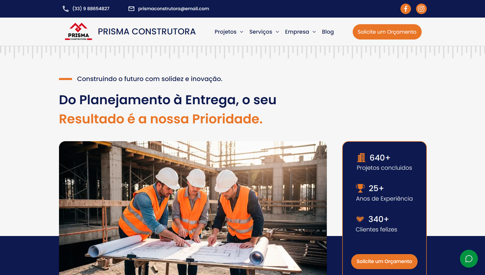

# Prisma Construtora

**Prisma Construtora** é uma plataforma digital elegante e funcional que apresenta os projetos residenciais, comerciais e corporativos da construtora com foco em **qualidade, inovação e transparência**. O site combina design moderno com usabilidade, permitindo que clientes explorem empreendimentos, conheçam a história da empresa e acompanhem um **blog técnico e inspirador** sobre arquitetura, construção sustentável e tendências do mercado imobiliário.

> **Acesse o site:** [https://site-construtora-prisma.vercel.app/](https://site-construtora-prisma.vercel.app/)

---

## Funcionalidades

- **Portfólio de empreendimentos** com filtros por tipo, localização e status
- **Páginas detalhadas** de projetos com galeria de fotos, plantas, vídeos e tours 360°
- **Blog corporativo** com artigos sobre construção civil, design de interiores e sustentabilidade
- **Formulário de contato inteligente** com integração direta ao time comercial
- **Chatbot de atendimento simples e eficiente** (veja abaixo)
- **Design responsivo** otimizado para todos os dispositivos
- **Performance máxima** com renderização no servidor (SSR) e lazy loading de imagens
- **SEO avançado** em todas as páginas e posts do blog

---

## Chatbot de Atendimento (Simples & Inteligente)

Incluído no site, um **chatbot leve, rápido e totalmente integrado** ao design da Prisma:

### Recursos do Bot:
- **Assistente Virtual da Prisma** com saudação personalizada
- **Navegação direta** para:
  - Projetos (Residenciais, Sob Medida, Obras Públicas)
  - Blog (`/blog`)
  - Contato via **WhatsApp** e **e-mail**
- **Redirecionamento com feedback**:
  - Clica → "Redirecionando..." → chat fecha → abre destino
- **Abre WhatsApp e e-mail em nova aba** (ou app)
- **Opções rápidas** com botões interativos
- **Animação de digitação** e scroll automático
- **Design 100% alinhado** com as cores `#0D194F` e `#E97527`
- **Totalmente responsivo** (mobile + desktop)
- 
---

## Tecnologias Utilizadas

| Tecnologia         | Uso |
|--------------------|-----|
| **React.js**       | Interfaces dinâmicas e componentes reutilizáveis |
| **Next.js**        | Renderização no servidor (SSR), rotas dinâmicas, SEO |
| **Tailwind CSS**   | Estilização responsiva, rápida e com design system |
| **Sanity CMS**     | Gerenciamento do **blog** (artigos, autores, categorias, imagens) |
| **Portable Text**  | Renderização rica de textos com **drop caps**, blockquotes, código e links estilizados |

---

## Estrutura do Blog (com Sanity)

O blog é totalmente gerenciado via **Sanity Studio**, permitindo que a equipe da Prisma publique:

- Artigos técnicos sobre fundações, estruturas metálicas e concreto armado  
- Dicas de decoração e acabamentos para apartamentos  
- Estudos de caso de obras entregues  
- Tendências em construção sustentável e certificações verdes  

### Recursos visuais no blog:
- **Drop cap estilizado** apenas no primeiro parágrafo  
- **Blockquotes com ícone** para citações de arquitetos  
- **Imagens com legendas** e sombras suaves  
- **Código destacado** para especificações técnicas  
- **Links com hover animado** e seta para externos  

---

## Authors

- [@lazaroalvesr](https://github.com/lazaroalvesr)

---

## Links

  

---

> **Desenvolvido com Next.js + Sanity + Tailwind CSS**  
> *Construindo o futuro, um tijolo (e um post) de cada vez.*
